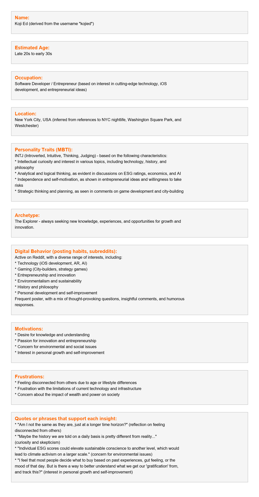

# 🧠 Reddit User Persona Generator

A modern, LLM-powered web application that analyzes a Reddit user's Reddit activity to generate a complete **psychological persona** — including name, age, MBTI type, occupation, motivations, frustrations, and behavioral patterns. The results are visualized as both **structured text** and a **styled PNG image** — perfect for researchers, marketers, analysts, and hobbyists.

---

## 🖥️ Web Interface (Streamlit)

The app provides an intuitive interface:

- 🔐 **Sidebar**: Enter your **Groq API Key**
- 🔎 **Main Input**: Paste Reddit **username or profile URL**
- ▶️ **Generate Persona**: Scrapes Reddit, sends to LLM, and renders output
- 📄 **Outputs**:
  - Formatted **persona text**
  - **Downloadable** text file
  - Rendered **PNG image**

---

## 📸 Example Output

### ✍️ Persona Text

```
Name: Koji Ed (u/kojied)  
Estimated Age: Late 20s to early 30s  
Occupation: iOS Developer  
Location: New York City  
Personality Traits (MBTI): ENTP  
...
```

---

### 🖼️ Persona Image Output

Below is the output generated by the app using Pillow:

>   


---

## 🧠 Features

✅ Scrapes Reddit data using **PRAW**  
✅ Uses **Groq’s LLaMA3 (via LangChain)** to generate insights  
✅ Returns:
- Name, Age, Location, Occupation  
- MBTI, Archetype, Motivations, Frustrations  
- Quotes & digital behavior  

✅ Converts output into:
- Markdown-style **text**
- Structured **PNG image**

✅ Built with **Streamlit UI**  
✅ One-click **downloads** for image and text

---

## 📁 Project Structure
```

reddit-persona-generator/
├── app.py                 # Streamlit App
├── persona_output.png     # Output image (auto-generated)
├── persona_user.txt   # Output text (auto-generated)
├── .env                   # Reddit API credentials (user-provided)
├── requirements.txt       # Python dependencies
├── user_interface.png       # website interface
└── README.md              # You are here 👋


```

---

## 🚀 How to Run This Project

### 1. Clone the Repo

```bash
git clone https://github.com/vishnushankar1/beyondchats-assignments.git
cd beyondchats-assignment
```

---

### 2. Setup Python Environment

**Using Conda (Recommended):**

```bash
conda create -n genai python=3.10 -y
conda activate genai
```

**Or Using venv:**

```bash
python -m venv venv
# On Linux/Mac
source venv/bin/activate
# On Windows
venv\Scripts\activate
```

---

### 3. Install Requirements

```bash
pip install -r requirements.txt
```

---

### 4. Create `.env` File

Create a file named `.env` and paste your Reddit API credentials:

```
REDDIT_CLIENT_ID=your_client_id_here
REDDIT_CLIENT_SECRET=your_client_secret_here
```

> 🔑 Get credentials from: [https://www.reddit.com/prefs/apps](https://www.reddit.com/prefs/apps)

---

### 5. Run the App

```bash
streamlit run app.py
```

Then open [http://localhost:8501](http://localhost:8501) in your browser.

---

## 📦 `requirements.txt`

```
streamlit
praw
python-dotenv
Pillow
langchain
langchain-groq
```

---

## 🌐 Example `.env` File

```
REDDIT_CLIENT_ID=abc123xyz
REDDIT_CLIENT_SECRET=supersecretvalue
```

---

## 📬 Author & Support

👤 Built by [Vishnu Shankar]  
📧 [vishnushankar123123@gmail.com](mailto:vishnushankar123123@gmail.com)  
🔗 GitHub: [https://github.com/vishnushankar1](https://github.com/vishnushankar1)

---

## 📄 License

Licensed under the MIT License.